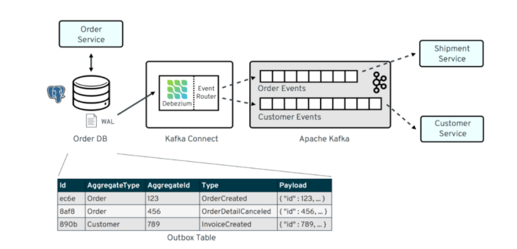

# 事务性发件箱

## todo
 - 轮训事务性发件箱来实现。publisher保证事件至少投递成功一次。同一个application则认为事件重放成功，则投递成功。

## 事务性发件箱模式

## 组件说明
### 事件总线 EventBus
- 持久化领域事件到发件箱表
- 查询发件箱表，并重放事件

### 事件中继 EventRelay
> 采用轮询发件箱实现
- 事件传播

### 事件发布器 DomainEventPublisherManager
- 管理一组发布器，默认使用Spring事件发布器。

 